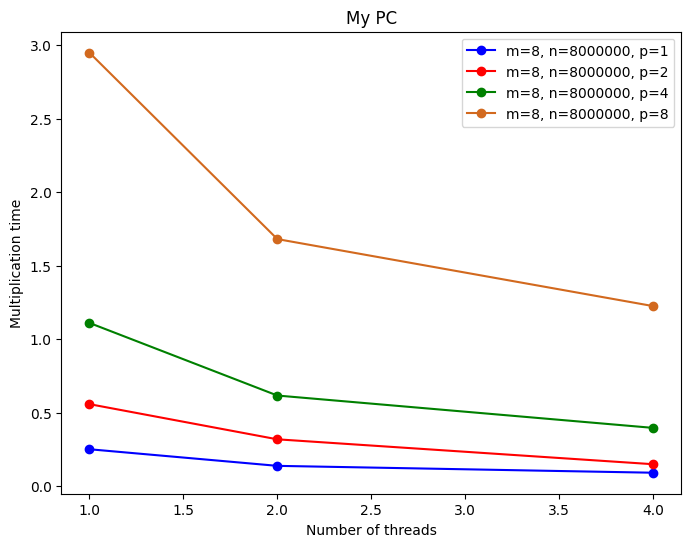
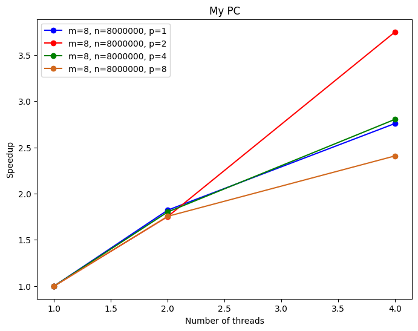
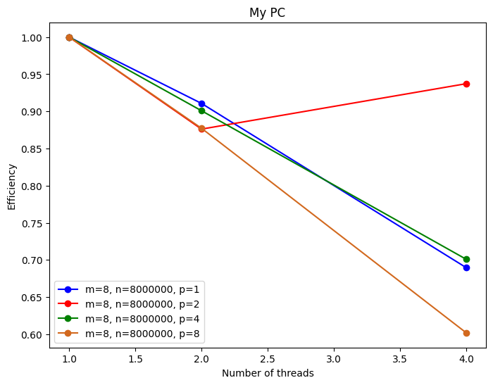

# MatMultPadding

## Compile and Run

The program can be built using the following commands:

- Build: `make`
- Build and Run: `make run`
- Build and Run with Valgrind: `make valgrind`
- Clean: `make clean`

Command line arguments can be modified in the `Makefile` under the `ARGS` variable.

## Parallelization Strategy

This project focuses on optimizing matrix multiplication through parallelization. The matrix multiplication algorithm has a complexity of O(n<sup>3</sup>). The associated pseudocode is as follows:


```plaintext
for i from 1 to m
    for j from 1 to p
        Y[i,j] = 0
        for k from 1 to n
            Y[i,j] = Y[i,j] + A[i,k]*B[k,j]
        end for
    end for
end for
```

Each thread is assigned a number of rows of the Y array and independently computes the corresponding elements of those rows. Load sharing is straightforward, and there are no race conditions between threads since each thread performs independent computations.

Arrays A, B, and Y are bound as one-dimensional to avoid cache misses. With 2D binding, a cache miss would occur every time a new line is accessed. One-dimensional binding ensures that multiple rows of the table may coexist in the same cache line.

For small Y dimensions, false sharing may occur. In extreme cases, such as Y with dimensions $8 \times 1$, all threads might belong to the same cache line, leading to increased cache misses and performance degradation.

### Solutions to False sharing

Two solutions are proposed:

1. Use a local variable to store the current value of Y[i,j] so that it is updated only after calculations are completed. This reduces the number of updates per line, mitigating cache misses.
2. Fill the Y array with padding to prevent threads from sharing the same cache line.

## Results

The project implements the second solution, filling the Y array with padding to avoid cache line sharing. Below are the performance results.







## Performance Considerations

- Adjust the number of threads based on the system and matrix dimensions for optimal performance.